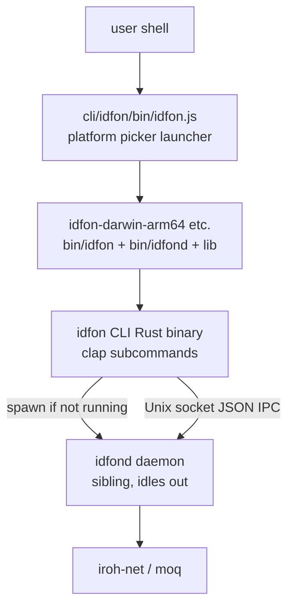

# CLI & npm Distribution Architecture

`cli/` is the npm distribution of the `idfon` CLI: a thin JS launcher plus
per-platform packages containing prebuilt Rust binaries. The Rust sources live in
`crates/`.

```text
crates/                        # Rust workspace
├── idfon-cli/                 # `idfon` binary: clap noun-verb subcommands
│                              #   (peer add, live stop, ...) → daemon methods
│                              #   auto-spawns idfond next to itself;
│                              #   daemon idles out when no clients (--keep-alive)
├── idfond/                    # the daemon: Unix-socket JSON IPC, iroh sessions
├── idfon-client/              # socket framing client (read_frame/write_frame)
├── idfon-protocol/            # shared request/response types
├── idfon-core/                # identity/keys/session core (ed25519 + iroh)
└── idfon-media/               # media pipeline

cli/                           # npm layout (pnpm workspace)
├── idfon/                     # `idfon` npm package
│   ├── package.json           # optionalDependencies → platform packages
│   └── bin/idfon.js           # launcher: picks idfon-<platform> by
│                              #   platform-arch, execs the binary; repo-layout
│                              #   fallback for uninstalled dev checkouts
└── idfon-<darwin-arm64|darwin-x64|linux-arm64|linux-x64>/
    └── bin/                   # idfon, idfond, libiroh_c_ffi.dylib/.so
                               #   (populated by scripts/build-cli.sh, gitignored)
```



Key facts:

- **CLI is a thin client**: `crates/idfon-cli` only parses args and maps them onto
  daemon methods; all networking lives in `idfond`. The CLI auto-starts `idfond`
  (located next to its own binary) which exits after an idle timeout when no
  clients remain.
- **One daemon, many clients**: the mac app, native-SDK app, and CLI all share the
  default `/tmp/idfon/idfond.sock` and can talk to the same daemon.
- **No win32**: idfond IPC is a Unix socket (`std::os::unix`); Windows needs a
  named-pipe transport first (noted in `idfon.js`).
- **Publish flow**: `scripts/build-cli.sh` populates `cli/idfon-*/bin/`,
  `scripts/publish-cli.sh` publishes; CI workflow `cli.yml` must be run with
  `gh workflow run cli --ref cli-v<ver>` (tag pushes fire nothing — no tags
  trigger). Package names on the registry stay `idfon` / `idfon-*`; see
  [npm-distribution.md](npm-distribution.md).
