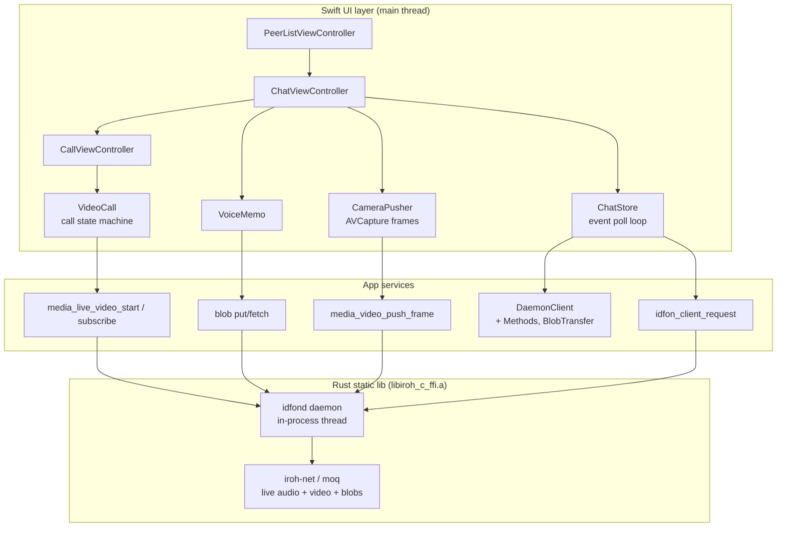

# iOS App Architecture

The iOS app (`ios/Idfon/`, ~2.3K lines Swift) is a UIKit app with programmatic UI that
talks to an **in-process Rust daemon** (`idfond`, via the `libiroh_c_ffi.a` static lib).

```text
ios/
├── Idfon/                    # Swift app (UIKit, programmatic UI)
│   ├── AppDelegate.swift     # app lifecycle, starts daemon + audio session
│   ├── SceneDelegate.swift   # window, auto-presents ringing screen on .incoming
│   ├── PeerListViewController.swift  # peer picker → chat
│   ├── ChatViewController.swift      # chat table + composer (text/record/review)
│   │                         #   + inline live-video bar (tap → expand)
│   ├── CallViewController.swift      # fullscreen call UI (answer/decline/hangup/collapse)
│   ├── ChatStore.swift       # polling event loop: waitMessages → notifications
│   ├── Models.swift          # Peer / Message / Event
│   ├── VideoCall.swift       # call state machine (dial/answer/route events)
│   ├── LiveCall.swift        # live audio dial + auto-answer helpers
│   ├── CameraPusher.swift    # AVCapture → FFI push_frame (BGRA 720x1280)
│   ├── VoiceMemo.swift       # AVAudioRecorder memo + waveform amplitudes
│   ├── LiveWaveformView.swift# mic-level visualization
│   ├── BlobTransfer.swift    # put/fetch blobs (memo & photo exchange)
│   ├── DaemonClient.swift    # JSON IPC request/response (5s timeout)
│   ├── DaemonClient+Methods.swift    # status/peers/sendText/waitMessages/events
│   ├── DaemonBootstrap.swift # spawns idfond on background thread, socket paths
│   └── Idfon-Bridging.h      # C ABI surface (daemon_run, client_request, media_*)
└── Vendor/                   # libiroh_c_ffi.a static lib (Rust, gitignored)
```



Key facts:

- **Daemon is in-process**: `AppDelegate` → `DaemonBootstrap.start()` runs
  `idfon_daemon_run` on a background `Thread` (16MB stack); it lives until process
  exit. No separate daemon binary.
- **One IPC channel, two usages**: JSON requests/responses (`idfon_client_request`
  over Unix socket, each call its own connection) for chat/events/peers, and direct C
  media functions that bypass IPC entirely (zero-copy frame push).
- **Events are polled**: `ChatStore` long-polls `waitMessages` (30s) and forwards to
  `VideoCall`/UI via notifications on the main queue.
- **Sim vs device socket path**: sim uses `/tmp/idfon-ios.sock` (sandbox paths exceed
  the 104-byte `SUN_LEN`), device uses flat tmp path.
