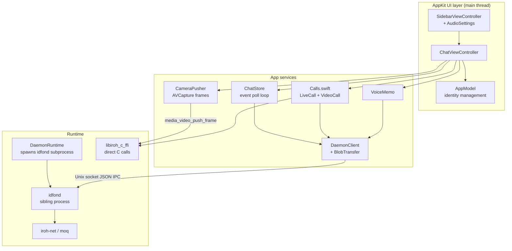

# macOS App Architecture

The macOS app (`mac/Sources/Idfon/`, ~3.3K lines Swift) is a SwiftPM-built AppKit app.
Unlike iOS (in-process daemon thread), **the daemon is a sibling subprocess**.

```text
mac/
├── Package.swift              # SwiftPM package (Idfon executable)
├── Sources/Idfon/
│   ├── IdfonApp.swift         # @main; AppDelegate, AppModel (identity mgmt),
│   │                          #   DetailContainerViewController, Placeholder
│   ├── SidebarViewController.swift  # peer list + AudioSettingsViewController
│   ├── ChatViewController.swift     # chat table + composer (text/memo/live call)
│   ├── ChatStore.swift        # polling event loop: waitMessages → updates
│   ├── DaemonRuntime.swift    # spawns idfond subprocess (bundle dir,
│   │                          #   ../target/release, /usr/local/bin); survives app quit
│   ├── DaemonClient.swift     # JSON IPC request/response over Unix socket
│   ├── DaemonClient+Methods.swift   # status/peers/sendText/waitMessages/events
│   ├── Calls.swift            # LiveCall (audio) + VideoCall state machines
│   ├── CameraPusher.swift     # AVCapture → FFI push_frame (1280x720 landscape)
│   ├── VoiceMemo.swift        # AVAudioRecorder memo + amplitudes
│   ├── WaveformView.swift     # mic-level visualization
│   ├── BlobTransfer.swift     # put/fetch blobs (memos & photos)
│   └── Models.swift           # Peer / Message / Event
└── Vendor/                    # libiroh_c_ffi (Rust, gitignored)
```



Key facts:

- **Daemon is a sibling subprocess**: `DaemonRuntime.launchIfNeeded()` locates
  `idfond` (bundle dir → `../target/release` → `/usr/local/bin`) and spawns it,
  logging to `/tmp/idfond-auto.log`. The child deliberately outlives the app —
  `idfond` is a system-wide service. Shared socket: `/tmp/idfon/idfond.sock`
  (see `crates/idfond`).
- **Same layering as iOS**: `DaemonClient` JSON IPC for chat/events, direct C media
  calls for the call/camera path (video uses landscape 1280x720 vs iOS portrait).
- **CLI interop**: the mac app and the `idfon` CLI share the same daemon/socket, so
  chats are visible from both.

See also: [video-media.md](video-media.md), [audio-media.md](audio-media.md),
[ios-architecture.md](ios-architecture.md) for the in-process-daemon variant.
