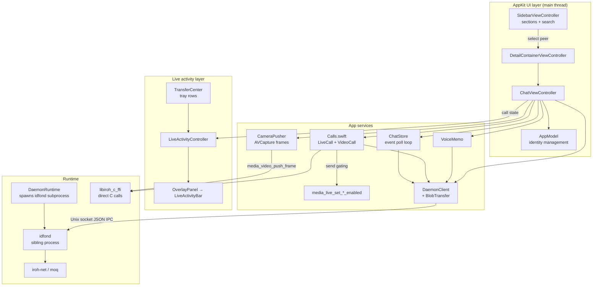

# macOS App Architecture

The macOS app (`mac/Sources/Idfon/`, ~4K lines Swift) is a SwiftPM-built AppKit app.
Unlike iOS (in-process daemon thread), **the daemon is a sibling subprocess**.

```text
mac/
├── Package.swift              # SwiftPM package (Idfon executable)
├── build.sh                   # swift build -c release + assembles Idfon.app
├── Sources/Idfon/
│   ├── IdfonApp.swift         # @main; AppDelegate, AppModel (identity mgmt),
│   │                          #   DetailContainerViewController, window + overlay wiring
│   ├── SidebarViewController.swift  # identity/status, tabbed peer lists, actions
│   ├── PeerTabsViewController.swift # Favorites/Recents/Contacts tabs, per-tab search
│   ├── ChatViewController.swift     # chat table + composer (text/file/memo),
│   │                          #   fullscreen call stage
│   ├── LiveActivityBar.swift  # the Bar surface + value-type model (expanded / pill)
│   ├── OverlayPanel.swift     # window-level Bar host (borderless floating panel)
│   ├── LiveActivityController.swift # maps call state → Bar models, routes Bar intents
│   ├── TransferCenter.swift   # Session Tray registry: transfer rows for the Bar
│   ├── Automation.swift       # `-sendfile` launch-arg entry + `idfon-auto:` markers
│   ├── Calls.swift            # LiveCall (audio) + VideoCall state machines,
│   │                          #   incl. send gating (mute / camera on/off)
│   ├── ChatStore.swift        # polling event loop: waitMessages → observers
│   ├── DaemonRuntime.swift    # spawns idfond subprocess (bundle dir,
│   │                          #   ../target/release, /usr/local/bin); outlives the app
│   ├── DaemonClient.swift     # JSON IPC request/response over Unix socket
│   ├── DaemonClient+Methods.swift   # status/peers/sendText/waitMessages/events
│   ├── CameraPusher.swift     # AVCapture → FFI push_frame (1280x720 landscape)
│   ├── VoiceMemo.swift        # AVAudioRecorder memo + amplitudes
│   ├── WaveformView.swift     # mic-level visualization
│   ├── BlobTransfer.swift     # chunked put (streams from disk) / fetch
│   └── Models.swift           # Peer / IdentityInfo / Event / MessageKind
├── Checks/                    # host-run checks (plain swiftc — no simulator)
└── Vendor/                    # libiroh_c_ffi (Rust, gitignored)
```



Key facts:

- **Daemon is a sibling subprocess**: `DaemonRuntime.launchIfNeeded()` locates
  `idfond` (bundle dir → `../target/release` → `/usr/local/bin`) and spawns it,
  logging to `/tmp/idfond-auto.log`. The child deliberately outlives the app —
  `idfond` is a system-wide service. Shared socket: `/tmp/idfon/idfond.sock`
  (see `crates/idfond`).
- **Same layering as iOS**: `DaemonClient` JSON IPC for chat/events, direct C media
  calls for the call/camera path (video uses landscape 1280x720 vs iOS portrait).
- **CLI interop**: the mac app and the `idfon` CLI share the same daemon/socket, so
  chats are visible from both.
- **The Bar is a window-level overlay**, like iOS but with different mechanics: a
  borderless non-activating `NSPanel` at `.floating`, **sized to exactly the bars**
  — so there is no safe-area dance and no `hitTest` pass-through, because there is
  no transparent area to forward. It docks under the title bar and reports its
  height, which the window applies through a top spacer so content shifts down.
- **The Bar is call/transfer-driven**, not idle chrome: mac has no navigation stack
  and the chat header owns idle actions (`Call`, share video, peer details), so the
  Bar renders only while a call or a transfer is in flight. `.watching` is a
  mac-only phase (one-way video share) whose stream toggles stay hidden.
- **Calls are two machines, one Bar model**: `LiveCall` (audio) and `VideoCall`
  are disjoint — separated by the invite's `media` value — and
  `LiveActivityController` renders whichever is non-idle. A call starts from the
  header's single `Call` button, publishes both tracks, and begins **mic-only**
  (camera off until the Bar's toggle); the Bar's `Mic`/`Cam` gate whether each
  published stream is *sent*.
- **Callbacks are fan-outs, not single closures**: `ChatStore` and both call
  machines notify every registered observer (`ChatStoreObserver`,
  `CallStateObserver`, held weakly). The chat header, the sidebar and the Bar all
  observe the same store, which is what makes several live views possible.
- **Sim vs device socket path**: N/A for mac — the daemon is a shared local
  process, and the app talks to it over the same socket the CLI uses.
- **On-mac automation**: `mac/build.sh` produces `build/Idfon.app`; `-sendfile
  <peer> <path>` (`Automation.swift`) selects the thread and calls the same
  `sendFile` the attachment panel reaches. `scripts/mac-e2e.sh` runs the bundle
  with that argument and asserts the `idfon tray:` / `idfon file:` markers — no
  simulator, no device, no install step.
- **Host-run checks**: `mac/Checks/*` compile with plain `swiftc` and run on the
  host (`MessageKindParseCheck`, `LiveActivityBarCheck`, `PeerTabsCheck`). AppKit
  views can be built without a running app, so per-state visibility, intent
  wiring and per-tab search are checked for real.

See also: [ui-design-notes.md](ui-design-notes.md) (UX spec),
[live-activity-bar-layout.md](live-activity-bar-layout.md) (Bar layout + mac
mapping), [video-media.md](video-media.md), [audio-media.md](audio-media.md),
[ios-architecture.md](ios-architecture.md) for the in-process-daemon variant.
