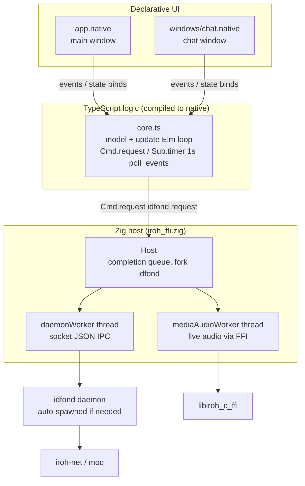

# Native-SDK App Architecture

`native/` is the Native-SDK build of Idfon: TypeScript + declarative `.native`
markup compiled to a native Zig binary — no JS runtime in the shipped app. It talks
to the same `idfond` daemon over the same Unix socket as the mac app and CLI.

```text
native/
├── app.json                   # Native SDK app manifest
├── src/
│   ├── app.native             # main window markup: identities, connections,
│   │                          #   capability tickets (declarative UI)
│   ├── windows/chat.native    # chat window markup (peer title bar, messages)
│   ├── core.ts                # the entire app logic (~1.5K lines): model state,
│   │                          #   Elm-style update(), Cmd.request / Sub.timer
│   └── iroh_ffi.zig           # Zig host: idfond.request bridge, media audio
│                              #   worker, auto-spawns idfond (fork), Unix socket
├── build.zig                  # Zig build: cargo-builds vendor/iroh-c-ffi
│                              #   (static + dylib), links the Zig core
├── vendor/iroh-c-ffi/         # Rust C-ABI lib (same crate the mac/iOS apps use)
├── assets/icons/              # app icons
└── zig-out/bin/               # build output (+ bundled libiroh_c_ffi.dylib)
```



Key facts:

- **No JS at runtime**: `core.ts` is compiled; the `.native` markup is resolved at
  build time. UI ↔ logic communicate via the Native SDK's event/binding mechanism
  (`on-press="..."` handlers map to `update()` messages).
- **Same daemon, same protocol**: `idfond.request` Cmds carry the same JSON IPC
  envelopes (`version/id/method/params`) as the Swift apps; socket defaults to
  `/tmp/idfon/idfond.sock` (per-profile paths supported via `ProfilePaths`).
- **Auto-spawn in Zig**: the host forks `idfond` (sibling of the binary) under a
  mutex on first request — same sibling-process model as the mac app, not the
  in-process model of iOS.
- **Media path**: live audio goes through a dedicated Zig worker thread calling the
  C-ABI media functions directly (bypasses the socket, like iOS/mac).
- **Result size cap**: 256 KiB (runtime `max_effect_host_result_bytes`), below the
  daemon's 1 MiB frame limit — `ponytail:` noted in `iroh_ffi.zig`.

See also: [daemon.md](daemon.md), [protocol.md](protocol.md).
